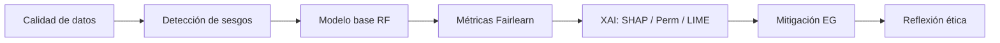

# Presentación técnica — Taller Ética, Sesgo y XAI en ML

**Curso:** MIAR0525 · Semana 4  
**Tema:** Predicción de mora en cuentas por cobrar (CxC)  
**Duración sugerida:** 5–10 minutos  
**Autor:** [Tu nombre] · [Fecha]

---

## 1. Introducción del problema

### Contexto de negocio

- Las empresas gestionan **cuentas por cobrar (CxC)** con miles de facturas; identificar **mora** (incumplimiento de pago) permite priorizar cobranza y gestionar riesgo crediticio.
- Un modelo que predice mora de forma automática puede **optimizar recursos**, pero también generar **impacto desigual** si discrimina por segmento comercial, provincia o variables sustitutas (*proxies*).

### Problema abordado

| Elemento | Descripción |
|----------|-------------|
| **Objetivo** | Clasificar facturas en **mora (1)** vs **sin mora (0)** |
| **Dataset** | Vista `Cust_v_ml_mora_cxc` — facturas cobradas 2023–2025 |
| **Volumen** | ~141.763 registros → **141.063** tras limpieza (700 duplicados) |
| **Balance** | ~**54%** con mora (clases casi equilibradas) |
| **Dominio** | Facturación real (no dataset sintético de demostración) |

### Riesgo ético inicial

> ¿Qué ocurre si el sistema marca mora de forma distinta según **segmento de cliente** o **provincia**, sin poder **explicar** ni **auditar** la decisión?

### Hipótesis de trabajo

1. El modelo puede tener **buena accuracy global** y aun así ser **inequitativo** entre grupos.
2. La **explicabilidad (XAI)** es necesaria para transparencia operativa y cumplimiento de buenas prácticas.
3. La **mitigación de sesgos** debe evaluarse con métricas de equidad, no solo con precisión.

---

## 2. Metodología y técnicas aplicadas

### Flujo del proyecto

### 2.1 Calidad de datos (Parte 1)

- Carga y perfilado del CSV `Cust_v_ml_mora_cxc_202605211939.csv`.
- Tratamiento de nulos en `ratio_monto_limite` (imputación con 0 cuando no hay límite).
- Eliminación de duplicados y auditoría de variables sensibles.

### 2.2 Detección de sesgos en datos (Parte 2)

- Análisis de tasa de mora por **`segmento_cliente`** y **`provincia`** (top 15).
- Hallazgo principal: brecha **Estado 72.7%** vs **SubDistribuidor Retail 27.6%** → **45.1 pp**.
- Desbalance de representación: **Mayorista ~92k** registros vs **Estado 11** registros.

### 2.3 Modelo predictivo (Parte 3)

| Parámetro | Valor |
|-----------|-------|
| **Algoritmo** | Random Forest (`n_estimators=100`, `max_depth=12`) |
| **Split** | 80% train / 20% test, estratificado por `mora` |
| **Features** | 14 numéricas + 4 categóricas (`tipo_contrib`, `forma_pago_cliente`, `grupo_descuento`, `antiguedad_categoria`) |
| **Excluidas** | `segmento_cliente`, `provincia` (atributos sensibles) |

### 2.4 Equidad — Fairlearn (Parte 4)

- **MetricFrame** por segmento: accuracy, precision, recall, selection rate.
- **Paridad demográfica (DPD):** diferencia en tasa de predicción positiva entre grupos.
- **Equalized odds difference:** disparidad en tasas de error.

### 2.5 Explicabilidad — XAI (Parte 5)

| Técnica | Rol |
|---------|-----|
| **SHAP** (TreeExplainer) | Importancia global (bar + beeswarm) y casos individuales (waterfall) |
| **Permutation Importance** | Validación independiente del ranking de variables |
| **LIME** | Explicación local; comparación con top SHAP en una instancia |

- Muestra de **3.000** instancias del test set por rendimiento.

### 2.6 Mitigación (Parte 6)

- **ExponentiatedGradient** + restricción **DemographicParity** (`eps=0.02`).
- Estimador interno: árbol de decisión (`max_depth=8`).
- Comparación formal: modelo base (RF) vs modelo mitigado.

---

## 3. Análisis comparativo entre modelos

### 3.1 Desempeño predictivo — Random Forest (base)

| Clase | Precision | Recall | F1 |
|-------|-----------|--------|-----|
| Sin mora | 0.92 | 0.76 | 0.83 |
| Con mora | 0.82 | 0.94 | 0.88 |
| **Accuracy global** | | **0.86** | |

**Lectura:** el modelo detecta bien la mora (alto recall), pero genera falsas alarmas relevantes (precision mora 0.82).

### 3.2 Equidad — Modelo base (RF)

| Métrica | Valor | Interpretación |
|---------|-------|----------------|
| **Accuracy global** | 0.8595 | Buen desempeño agregado |
| **DPD** | **0.7297** | Hasta **~73 pp** de diferencia en tasa de predicción positiva entre segmentos |
| **Equalized odds diff.** | **1.0000** | Disparidad extrema en errores por grupo |

**Ejemplos por segmento (test):**

- **Estado:** selection rate predicho **0%**, accuracy **0%** (grupo diminuto, n=11 en datos).
- **Sub Distribuidor Mayorista:** selection rate **~64%** (grupo dominante).
- **Empleados Inselec:** recall **1.0**, selection rate **40%**.

### 3.3 Variables que más influyen (XAI)

**Ranking coincidente (SHAP + Permutation):**

1. `monto_cuota` — domina claramente (~2× la segunda variable).
2. `num_cuota`
3. `plazo_credito_dias`
4. `forma_pago_cliente` (posible **proxy** de segmento)

**Casos individuales:**

| Caso | Señal dominante |
|------|-----------------|
| Predicción **mora=1** | `monto_cuota` alto (~172), pocas cuotas |
| Predicción **mora=0** | `monto_cuota` bajo (~4) |

**SHAP vs LIME (instancia local):** coinciden en `monto_cuota` y `forma_pago_cliente`; LIME expresa reglas en rangos (ej. `70 < monto_cuota ≤ 266`).

### 3.4 Comparación Base vs Mitigado

| Métrica | Modelo base (RF) | Modelo mitigado (Exp. Gradient) |
|---------|------------------|--------------------------------|
| **Accuracy** | **0.8595** | **0.8277** |
| **\|DPD\|** | **0.7297** | **0.8750** |
| Max selection rate | 0.7297 | 0.8750 |
| Min selection rate | 0.0000 | 0.0000 |

**Conclusión del comparativo:**

- El modelo mitigado **reduce accuracy ~3.2 pp** y **empeora la paridad demográfica** en esta corrida.
- La mitigación automática **no garantiza** equidad; depende de datos, tamaño de grupos y configuración.
- Para producción, el **RF base** no es “justo” pero el mitigado actual **no es alternativa viable** sin rediseño.

### 3.5 Síntesis visual (referencia al notebook)

Incluir en la exposición oral (capturas del notebook):

1. Gráfico de mora por **segmento** y **provincia** (Parte 2).
2. **Matriz de confusión** + métricas Fairlearn (Partes 3–4).
3. **SHAP bar/beeswarm** + **Permutation** (Parte 5).
4. **Waterfall** (2 casos) + gráfico **LIME**.
5. **Trade-off** accuracy vs |DPD| (Parte 6).

---

## 4. Conclusiones y recomendaciones

### Conclusiones

1. **Desempeño ≠ equidad:** accuracy ~86% coexiste con DPD ~0.73; un KPI global oculta trato desigual por segmento.
2. **Sesgo en datos y en predicciones:** brechas históricas grandes y grupos subrepresentados limitan modelos justos.
3. **Transparencia alcanzable:** SHAP, Permutation y LIME convergen en drivers financieros (`monto_cuota`, `num_cuota`, plazo) y señalan proxies (`forma_pago_cliente`).
4. **Mitigación con matices:** Fairlearn aplicado no mejoró DPD; documentar el fracaso es tan valioso como reportar éxito.
5. **Riesgo de despliegue:** sin XAI y sin monitoreo por grupo, el sistema sería una caja negra con impacto comercial y reputacional.

### Recomendaciones

| Área | Acción |
|------|--------|
| **Gobernanza** | No automatizar decisiones finales; revisión humana en segmentos pequeños y casos límite. |
| **Monitoreo** | Dashboard con accuracy, DPD, recall y selection rate **por segmento** (y provincia). |
| **Datos** | Enriquecer minorías (p. ej. Estado), auditar proxies y fuga de información en `monto_cuota`. |
| **Modelo** | Probar umbrales por grupo, re-muestreo o post-procesamiento; reentrenar mitigación con más iteraciones/grupos consolidados. |
| **XAI** | Explicación obligatoria por alerta (SHAP/LIME); archivo auditable para quejas de clientes. |
| **Ética** | Política explícita sobre variables permitidas; alineación con beneficencia, justicia y transparencia. |

### Mensaje de cierre (30 segundos)

> El taller demuestra que predecir mora con ML es técnicamente viable, pero **implementarlo de forma responsable** exige medir sesgos, explicar decisiones y validar que las correcciones de equidad **realmente funcionen** — no solo reducir accuracy en el papel.

---

## Guía rápida para exponer (5–10 min)

| Bloque | Tiempo | Enfocar en |
|--------|--------|------------|
| 1. Problema | 1–2 min | CxC, mora, riesgo ético |
| 2. Metodología | 2–3 min | Pipeline: calidad → sesgos → RF → Fairlearn → XAI → mitigación |
| 3. Comparativo | 2–4 min | Tabla RF vs mitigado + gráficos XAI + DPD 0.73 |
| 4. Conclusiones | 1–2 min | No desplegar sin controles; 3 recomendaciones concretas |

---

## Referencias

- Notebook: `MIAR0525_S4_Taller_Etica_Sesgo_ML_GV.ipynb`
- Dataset: `Cust_v_ml_mora_cxc_202605211939.csv`
- SHAP (Lundberg & Lee, 2017) · LIME (Ribeiro et al., 2016) · Fairlearn (Agarwal et al., 2018)
